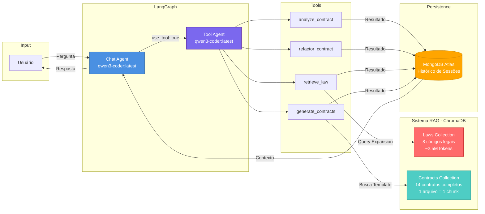

# ContratAI - Assistente Jurídico Inteligente

> **FIAP - Global Solution 2024/2025**  
> **Tema:** O Futuro do Trabalho  
> **Curso:** Análise e Desenvolvimento de Sistemas

[](https://www.python.org/)
[](https://www.langchain.com/)
[](https://github.com/langchain-ai/langgraph)
[](https://ollama.ai/)
[](https://www.trychroma.com/)

---

## Sobre o Projeto

**ContratAI** é um assistente jurídico inteligente desenvolvido como solução para o desafio **"O Futuro do Trabalho"** da Global Solution FIAP. O sistema utiliza **Inteligência Artificial Generativa** (LLMs locais) combinada com **RAG (Retrieval-Augmented Generation)** para democratizar o acesso à informação jurídica e automatizar processos contratuais complexos.

### Problema Identificado

No futuro do trabalho:
- **Democratização do conhecimento jurídico**: Profissionais autônomos, freelancers e pequenos empreendedores frequentemente não têm acesso a assessoria jurídica acessível
- **Complexidade contratual**: Contratos são documentos técnicos e intimidadores para não-advogados
- **Conformidade legal**: Garantir que contratos estejam em conformidade com a legislação brasileira (LGPD, CC, CLT, CDC)
- **Análise de riscos**: Identificar cláusulas abusivas, omissões e riscos jurídicos sem depender de consultorias caras
- **Automação jurídica**: Reduzir tempo e custos em processos contratuais repetitivos

### Solução Proposta

O ContratAI utiliza **Inteligência Artificial Generativa** (LLMs locais via Ollama) combinada com **RAG (Retrieval-Augmented Generation)** para oferecer:

1. **Análise Profunda de Contratos** - Identificação de riscos jurídicos, cláusulas ausentes, obrigações das partes e conformidade legal com feedback detalhado
2. **Reformulação de Contratos** - Otimização de redação, correção de cláusulas abusivas, adequação à LGPD/CC/CLT/CDC com resumo executivo das mudanças
3. **Consulta à Legislação Brasileira** - Busca semântica inteligente em 8 códigos legais completos com query expansion e reranking
4. **Geração de Contratos Personalizados** - Criação de contratos profissionais baseados em 14 templates especializados com validação de campos
5. **Histórico Persistente** - Armazenamento de conversas no MongoDB Atlas para continuidade e auditoria completa de sessões

---

## Arquitetura do Sistema

### Tecnologias Utilizadas

| Tecnologia | Versão | Função |
|-----------|--------|--------|
| **Python** | 3.11 | Linguagem principal |
| **LangChain** | 1.0.7 | Framework para aplicações LLM |
| **LangGraph** | 1.0.3 | Orquestração de agentes multi-step com grafo de estados |
| **FastAPI** | latest | API REST para gerenciamento de sessões e agente |
| **Ollama** | 0.6.1 | Execução local de LLMs |
| **qwen3-coder:latest** | - | Modelo LLM principal (agents) |
| **mistral-nemo:12b** | - | Modelo LLM principal (embeddings) |
| **gpt-oss:20b** | - | Modelo para validação de contratos (JSON estruturado) |
| **ChromaDB** | 1.3.4 | Banco vetorial persistente para RAG |
| **MongoDB Atlas** | 4.15.4 | Persistência de histórico de conversas |
| **Sentence Transformers** | 3.0.0 | CrossEncoder reranker (ms-marco-MiniLM-L-6-v2) |
| **PDFPlumber** | 0.11.8 | Extração de texto de PDFs (futuro) |

---

## Arquitetura do Sistema

### Fluxo de Conversa (LangGraph StateGraph)


### Arquitetura RAG + LLM



### Decisão do Chat Agent


---

### Sistema RAG (Retrieval-Augmented Generation)

#### 1. **RAG de Legislação** (laws_collection)
- **Base de dados**: 8 códigos legais brasileiros (~2.5M tokens)
  - Constituição Federal 1988
  - Código Civil (Lei 10.406/2002)
  - Código de Processo Civil
  - Código Penal
  - Código de Processo Penal
  - CLT (Consolidação das Leis do Trabalho)
  - CDC (Código de Defesa do Consumidor)
  - ECA (Estatuto da Criança e do Adolescente)
- **Chunking**: `RecursiveCharacterTextSplitter` com separadores específicos (`Art.`, `TÍTULO`, `CAPÍTULO`)
- **Estratégia**: Query expansion + busca por similaridade vetorial
- **Chunk size**: 1000 chars, overlap: 200

#### 2. **RAG de Contratos** (contracts_collection)
- **Base de dados**: 14 contratos profissionais completos
  - Trabalho CLT
  - Compra/Venda Veículo
  - Parceria Comercial e Distribuição
  - Doação de Imóvel
  - Sociedade Empresária Ltda
  - Cessão de Direitos de Imagem
  - Desenvolvimento de Software
  - Cessão de Quotas Sociais (M&A)
  - Comodato de Imóvel
  - Constituição de Holding Familiar
  - Corretagem Imobiliária
  - Locação Imóvel Urbano
  - Prestação de Serviços
  - Promessa de Compra e Venda
- **Estratégia**: **Sem RAG/embeddings** - validação direta via LLM
- **Vantagem**: LLM recebe lista completa de contratos e escolhe o tipo correto com contexto total
- **Uso**: Validação de tipo de contrato via `contract_filter()` antes de carregar template específico

---

## Funcionalidades Principais

### 1. Análise de Contratos (`analyze_contract`)

**Análise jurídica profunda com feedback detalhado ao usuário:**

**Logging durante execução:**
- Analisando contrato...
- Carregando documento do caminho especificado...
- Executando análise jurídica profunda...
- Análise concluída com sucesso!

**Saída JSON estruturada:**

```json
{
  "answer": "Análise concluída: Risco MÉDIO identificado. Recomendado adicionar cláusulas de LGPD e revisar cláusula de exclusividade.",
  "metadata": {
    "contract_type": "Prestação de Serviços",
    "parties": {"contractor": "...", "contracted": "..."},
    "date": "01/12/2024",
    "value": "R$ 50.000,00",
    "duration": "12 meses"
  },
  "risk_analysis": {
    "overall_risk": "Médio",
    "high_risks": [
      {
        "description": "Cláusula de exclusividade sem contrapartida",
        "legal_basis": "Art. 422 do Código Civil",
        "impact": "Abusividade contratual",
        "recommendation": "Adicionar cláusula de exclusividade recíproca"
      }
    ]
  },
  "missing_clauses": [
    {"clause_name": "Proteção de Dados (LGPD)", "importance": "Crítica"}
  ],
  "obligations": {
    "contractor": [...],
    "contracted": [...]
  },
  "executive_summary": {
    "rationale": "3-5 parágrafos detalhados com citações legais...",
    "recommendation": "..."
  }
}
```

### 2. Reformulação de Contratos (`refactor_contract`)

**Otimização de contratos com feedback detalhado:**

**Logging durante execução:**
- Iniciando reformulação do contrato...
- Carregando contrato original...
- Executando análise e reformulação...
- Reformulação concluída! Contrato salvo em: refactored_contract.txt
- Tamanho do arquivo: X KB

**Saída JSON estruturada:**

```json
{
  "answer": "Contrato reformulado com sucesso! Principais mudanças: adicionadas 3 cláusulas (LGPD, Força Maior, Não-concorrência), corrigidas 2 cláusulas abusivas. Arquivo salvo em refactored_contract.txt.",
  "refactored_contract": {
    "title": "CONTRATO DE PRESTAÇÃO DE SERVIÇOS - VERSÃO REFORMULADA",
    "summary": "Resumo executivo em 2-3 parágrafos: (1) o que foi reformulado e por quê, (2) principais melhorias implementadas, (3) impacto prático das mudanças",
    "full_text": "Contrato completo reformulado...",
    "structure": [...]
  },
  "changes_made": {
    "additions": ["Cláusula de LGPD", "Cláusula de Força Maior"],
    "modifications": ["Cláusula de rescisão - adequada ao CDC"],
    "removals": ["Cláusula abusiva de renúncia de direitos"]
  },
  "legal_analysis": [...],
  "recommendations": [...],
  "metadata": {...}
}
```

### 3. Consulta à Legislação (`retrieve_brazilian_law_context_and_answer`)

**Busca inteligente em legislação brasileira com pipeline completo:**

**Logging durante execução:**
- Filtrando arquivos de lei relevantes...
- Arquivos selecionados: CONSOLIDACAODASLEISDOTRABALHO.txt, CONSTITUICAOFEDERAL.txt
- Buscando na base de legislação (laws_collection)...
- 15 chunks encontrados
- Expandindo query para melhorar resultados...
- Reordenando resultados por relevância (reranking)...
- Top 5 documentos mais relevantes selecionados

**Pipeline RAG:**
1. **Filtragem de arquivos** - Usa gpt-oss:20b para identificar leis relevantes à pergunta
2. **Query Expansion** - Gera 2 variações da query usando prompt expand_query.txt
3. **Busca Vetorial** - ChromaDB com embeddings mistral-nemo:12b
4. **Reranking** - CrossEncoder (ms-marco-MiniLM-L-6-v2) reordena por relevância
5. **Top-K Selection** - Seleciona 5 documentos mais relevantes

**Exemplo:**
```python
"Quais são os direitos trabalhistas em caso de demissão sem justa causa?"

# Resposta com citações legais
{
  "answer": "Em caso de demissão sem justa causa, o trabalhador tem direito a: saldo de salário, aviso prévio (indenizado ou trabalhado), férias vencidas + 1/3, férias proporcionais + 1/3, 13º salário proporcional, saque do FGTS + multa de 40%, seguro-desemprego. Base legal: Art. 477 da CLT, Art. 7º CF/88.",
  "sources": [
    {"file": "CONSOLIDACAODASLEISDOTRABALHO.txt", "content": "Art. 477..."},
    {"file": "CONSTITUICAOFEDERAL.txt", "content": "Art. 7º..."}
  ]
}
```

### 4. Geração de Contratos (`generate_contracts`)

**Criação de contratos personalizados baseados em 14 templates profissionais:**

**Logging durante execução:**
- Iniciando geração de contrato...
- Buscando template mais adequado na base de contratos...
- Template encontrado: CONTRATO DE PRESTAÇÃO DE SERVIÇOS
- Preenchendo campos do contrato...
- Contrato gerado com sucesso!

**Fluxo de geração:**
1. **Validação de Tipo** - LLM recebe lista completa de 14 contratos e escolhe o tipo correto
2. **Carregamento de Template** - Carrega arquivo `.txt` específico diretamente do disco
3. **Validação de Campos** - Verifica se todos os campos necessários foram fornecidos via prompt inteligente
4. **Preenchimento** - Usa prompt `fill_contract.txt` para preencher template com dados do usuário
5. **Validação Legal** - Garante conformidade com LGPD, CC, CLT, CDC

**Exemplo:**
```python
"Crie um contrato de prestação de serviços para desenvolvimento de software entre TechCorp e ClienteSA, valor R$ 50.000, prazo 6 meses"

# Saída
{
  "answer": "Contrato de Prestação de Serviços gerado com sucesso! Baseado no template profissional com cláusulas de LGPD, propriedade intelectual e não-concorrência.",
  "status": "completed",
  "filled_contract": "CONTRATO DE PRESTAÇÃO DE SERVIÇOS\n\nCONTRATANTE: TechCorp...\nCONTRATADA: ClienteSA...\nVALOR: R$ 50.000,00...\n[Contrato completo com todas as cláusulas]"
}

# Caso faltem informações
{
  "answer": "Para gerar o contrato, preciso das seguintes informações adicionais: endereço completo das partes, CNPJ/CPF, forma de pagamento.",
  "status": "missing_info",
  "missing_fields": ["endereco_contratante", "cnpj_contratante", "forma_pagamento"]
}

---

## Estrutura do Projeto

```
ContratAIIOT/
├── main.py                           # Aplicação principal (LangGraph workflow)
├── api.py                            # FastAPI REST API para gerenciamento de sessões
├── tools.py                          # Ferramentas/Tools para agentes (5 tools)
├── llm_config.py                     # Configuração Ollama + ChromaDB
├── rag_functions.py                  # Funções RAG (chunking, embedding, query expansion, validation)
├── contract_fields_mapping.json      # Mapeamento de campos para geração de contratos
├── inspect_chunks.py                 # Utilitário para inspecionar chunks no ChromaDB
├── inspect_sqlite.py                 # Utilitário para inspecionar banco SQLite do ChromaDB
├── .env                              # Variáveis de ambiente (MongoDB, Ollama)
├── pyproject.toml                    # Dependências do projeto (uv)
├── uv.lock                           # Lock file do uv
│
├── prompts/                          # Sistema de prompts externalizados
│   ├── chat_agent.txt                # Prompt do Chat Agent (decisor de routing)
│   ├── tool_agent.txt                # Prompt do Tool Agent (seleção e execução)
│   ├── analyze_contract.txt          # Prompt de análise de contratos (rationale detalhado)
│   ├── refactor_contract.txt         # Prompt de reformulação (com campo summary)
│   ├── retrieve_law.txt              # Prompt de consulta legislação
│   ├── expand_query.txt              # Prompt de expansão de queries para RAG
│   ├── fill_contract.txt             # Prompt de preenchimento de templates
│   ├── filter_law_files.txt          # Prompt de filtragem de arquivos de leis
│   └── filter_contract_fields.txt    # Prompt de validação de tipo de contrato
│
├── rag_files/
│   ├── contracts/                    # 14 contratos templates (.txt)
│   │   ├── CONTRATO DE TRABALHO COM REGISTRO CLT.txt
│   │   ├── CONTRATO DE DESENVOLVIMENTO DE SOFTWARE.txt
│   │   ├── CONTRATO DE CONSTITUIÇÃO DE HOLDING FAMILIAR.txt
│   │   ├── CONTRATO DE PRESTAÇÃO DE SERVIÇOS.txt
│   │   ├── CONTRATO DE LOCAÇÃO DE IMÓVEL URBANO.txt
│   │   ├── CONTRATO DE CESSÃO DE DIREITOS DE IMAGEM.txt
│   │   ├── CONTRATO DE PARCERIA COMERCIAL E DISTRIBUIÇÃO.txt
│   │   ├── CONTRATO DE COMPRA E VENDA DE VEÍCULO.txt
│   │   ├── CONTRATO MODELO REAL.txt             # Exemplo de excelência profissional
│   │   ├── CONTRATO DE EXEMPLO COM ERROS.txt    # Exemplo para testes
│   │   └── ... (mais 4 contratos)
│   │
│   └── laws/                         # 8 códigos legais brasileiros (.txt)
│       ├── CONSTITUICAOFEDERAL.txt
│       ├── CODIGOCIVIL.txt
│       ├── CONSOLIDACAODASLEISDOTRABALHO.txt
│       ├── CODIGODEFESADOCONSUMIDOR.txt
│       ├── CODIGOPROCESSOCIVIL.txt
│       ├── CODIGOPENAL.txt
│       ├── CODIGOPROCESSOPENAL.txt
│       └── ESTATUTOCRIANCAADOLESCENTE.txt
│
├── chroma_db_laws/                   # ChromaDB persistente (embeddings)
│   ├── chroma.sqlite3                # Banco SQLite com metadados
│   └── 5dbf0b49-3196-4f82-b5c0-9f603523f1a7/  # Collection data
│
├── __pycache__/                      # Cache Python
└── README.md                         # Este arquivo
```

---

## Instalação e Configuração

### Pré-requisitos

- **Python 3.11**
- **Ollama** instalado ([ollama.ai](https://ollama.ai/))
- **Modelos Ollama**
- **MongoDB Atlas** (ou local)

### 1. Clone o Repositório

```bash
git clone <repository-url>
cd ContratAIIOT
```

### 2. Instale os Modelos Ollama

```bash
ollama pull mistral-nemo:12b # Modelo para embeddings
ollama pull qwen3-coder:latest  # Modelo principal (agents)
ollama pull gpt-oss:20b       # Modelo para filtragem de leis (JSON estruturado)
```

### 3. Configure as Dependências

**Opção A: Usando `uv` (recomendado)**

```bash
pip install uv
uv sync
```

**Opção B: Usando `pip`**

```bash
pip install -r requirements.txt
pip install langchain langchain-core langchain-community langchain-ollama
pip install langgraph ollama chromadb pymongo python-dotenv
```

### 4. Configure o `.env`

Crie um arquivo `.env` na raiz do projeto:

```env
# MongoDB Atlas
DB_PASSWORD=sua_senha_mongodb

# Ollama (se necessário)
OLLAMA_HOST=http://localhost:11434

# ChromaDB (opcional)
CHROMA_PERSIST_DIRECTORY=./chroma_db_laws
```

### 5. Inicialize o ChromaDB (Primeira Execução)

Na primeira execução, o sistema automaticamente:
- Carrega todos os arquivos de `rag_files/laws/` (8 códigos legais)
- Cria chunks com `RecursiveCharacterTextSplitter` (tamanho: 1200, overlap: 200)
- Gera embeddings com `OllamaEmbeddings` (mistral-nemo:12b)
- Persiste no ChromaDB (`chroma_db_laws/`)
- Exibe progresso: "Progress: X/Y chunks (Z%)"

**Importante:** 
- Este processo pode levar 5-10 minutos na primeira vez
- Contratos **não usam ChromaDB** - validação direta via LLM para maior precisão
- Leis são divididas em chunks de 1200 caracteres com separadores (`Art.`, `§`, `CAPÍTULO`)

### 6. Execute o Assistente (CLI)

```bash
python main.py
```

**Ou ative o ambiente virtual primeiro:**

```bash
source .venv/bin/activate  # Linux/Mac
# ou
.venv\Scripts\activate     # Windows

python main.py
```

### 7. Execute a API REST (Opcional)

```bash
python api.py
# ou
uvicorn api:api --reload --host 0.0.0.0 --port 8000
```

Acesse a documentação interativa em: `http://localhost:8000/docs`

---

## API REST Endpoints

### Gerenciamento de Sessões

#### `GET /sessions`
Lista todas as sessões de chat armazenadas no MongoDB.

```bash
curl http://localhost:8000/sessions
```

#### `GET /sessions/{session_id}`
Obtém uma sessão específica com todo o histórico de mensagens.

```bash
curl http://localhost:8000/sessions/abc12345
```

#### `POST /sessions`
Cria uma nova sessão de chat vazia.

```bash
curl -X POST http://localhost:8000/sessions
```

**Resposta:**
```json
{
  "session_id": "abc12345",
  "message": "Sessão criada com sucesso"
}
```

#### `PUT /sessions/{session_id}`
Atualiza as mensagens de uma sessão existente.

```bash
curl -X PUT http://localhost:8000/sessions/abc12345 \
  -H "Content-Type: application/json" \
  -d '{
    "messages": [
      {"timestamp": "2024-12-01T10:00:00Z", "role": "user", "content": "Olá"},
      {"timestamp": "2024-12-01T10:00:05Z", "role": "assistant", "content": "Olá! Como posso ajudar?"}
    ]
  }'
```

#### `DELETE /sessions/{session_id}`
Deleta uma sessão específica.

```bash
curl -X DELETE http://localhost:8000/sessions/abc12345
```

#### `DELETE /sessions`
**CUIDADO:** Deleta todas as sessões do banco de dados.

```bash
curl -X DELETE http://localhost:8000/sessions
```

### Interação com o Agente

#### `POST /chat`
Envia uma pergunta para o agente ContratAI e recebe a resposta processada.

```bash
curl -X POST http://localhost:8000/chat \
  -H "Content-Type: application/json" \
  -d '{
    "question": "Quero gerar um contrato de prestação de serviços",
    "session_id": "abc12345"
  }'
```

**Resposta:**
```json
{
  "session_id": "abc12345",
  "answer": "Para gerar o contrato de prestação de serviços, preciso das seguintes informações...",
  "tool_used": "generate_contracts"
}
```

**Parâmetros:**
- `question` (string, obrigatório): Pergunta ou comando para o agente
- `session_id` (string, opcional): ID da sessão. Se omitido, cria nova sessão

### Informações do Sistema

#### `GET /`
Retorna informações gerais da API e lista de endpoints disponíveis.

```bash
curl http://localhost:8000/
```

#### `GET /tools`
Lista todas as ferramentas disponíveis no sistema com descrições e parâmetros.

```bash
curl http://localhost:8000/tools
```

**Resposta:**
```json
{
  "tools": [
    {
      "name": "analyze_contract",
      "description": "Realiza análise completa de contratos...",
      "parameters": [...]
    },
    {
      "name": "generate_contracts",
      "description": "Gera contratos personalizados...",
      "parameters": [...]
    }
  ]
}
```

---

## Como Usar

### Iniciando uma Sessão

```
Digite o ID da sessão (ou Enter para nova sessão): 

Nova sessão criada com ID: abc12345

Digite sua pergunta jurídica: _
```

### Exemplos de Perguntas

#### 1. Análise de Contrato

```
Analise o contrato em rag_files/contracts/CONTRATO DE TRABALHO COM REGISTRO CLT.txt
```

**O sistema vai:**
- Ler o arquivo
- Identificar metadados (partes, valores, prazos)
- Analisar riscos jurídicos
- Identificar cláusulas ausentes
- Mapear obrigações das partes
- Gerar resumo executivo

#### 2. Consulta à Legislação

```
Quais são os prazos para aviso prévio na CLT?
```

**O sistema vai:**
- Buscar no RAG de legislação (CLT)
- Retornar artigos relevantes (Art. 487, Art. 488)
- Explicar em linguagem acessível
- Fornecer confidence score

#### 3. Reformulação de Contrato

```
Reformule o contrato em rag_files/contracts/CONTRATO DE PRESTAÇÃO DE SERVIÇOS.txt 
adicionando cláusula de LGPD e corrigindo cláusulas abusivas
```

**O sistema vai:**
- Ler o contrato original
- Identificar problemas legais
- Adicionar cláusula de proteção de dados (LGPD)
- Corrigir cláusulas abusivas/ilegais
- Retornar contrato reformulado completo

#### 4. Perguntas Simples (Sem Tool)

```
O que é um contrato de comodato?
```

**O Chat Agent responde diretamente sem chamar tools.**

---

## Testes e Validação

### Limpeza do ChromaDB

Se precisar resetar o banco vetorial:

```bash
python clean_database.py
```

### Sessões Persistentes

O sistema mantém histórico completo no MongoDB Atlas:

```python
# Carregar sessão anterior
Digite o ID da sessão (ou Enter para nova sessão): abc12345

Sessão 'abc12345' carregada! (12 mensagens)

# Estrutura no MongoDB
{
  "session_id": "abc12345",
  "messages": [
    {"role": "user", "content": "..."},
    {"role": "assistant", "content": "..."},
    {"role": "tool", "tool_call_id": "...", "name": "analyze_contract", "content": "{...}"}
  ]
}
```

### Ferramentas de Inspeção

**Inspecionar chunks no ChromaDB:**
```bash
python inspect_chunks.py
```

**Inspecionar banco SQLite do ChromaDB:**
```bash
python inspect_sqlite.py
```

---

## Diferenciais do Projeto

### 1. **LLM 100% Local (Privacidade)**
- Nenhum dado enviado para APIs externas (OpenAI, Anthropic)
- Conformidade com LGPD para dados sensíveis
- Zero custo de API

### 2. **RAG Especializado em Legislação Brasileira**
- 8 códigos legais completos (~2.5M tokens)
- Query expansion para melhor recall
- Separadores customizados para estrutura legal (Art., §, incisos)

### 3. **Arquitetura de Agentes (LangGraph)**
- Chat Agent decide quando usar ferramentas
- Tool Agent executa ferramentas específicas
- Separação clara de responsabilidades

### 4. **Contratos Profissionais Completos**
- 14 templates jurídicos detalhados
- Citações legais completas (CF, CC, CLT, CDC, LGPD)
- Cláusulas modernas (LGPD, não-concorrência, governança)

### 5. **Histórico Persistente (MongoDB Atlas)**
- Sessões recuperáveis por ID único
- Auditoria completa de conversas (user/assistant/tool messages)
- Contexto preservado entre execuções
- Suporte a continuação de análises complexas

### 6. **Logging Detalhado**
- Feedback em tempo real de todas as operações
- Progresso de embedding: "Progress: X/Y chunks (Z%)"
- Etapas RAG: filtragem → busca → expansão → reranking
- Confirmação de salvamento de contratos reformulados
- Mensagens user-friendly sem emojis

---

## Agradecimentos

- **FIAP** - Pela proposta desafiadora da Global Solution
- **LangChain** - Framework poderoso para aplicações LLM
- **Ollama** - Execução local de LLMs de forma simples
- **Comunidade Open Source** - Pelas ferramentas incríveis disponibilizadas

---

<div align="center">

**Democratizando o acesso à justiça através da Inteligência Artificial**

**FIAP Global Solution 2024/2025 - O Futuro do Trabalho**

</div>
